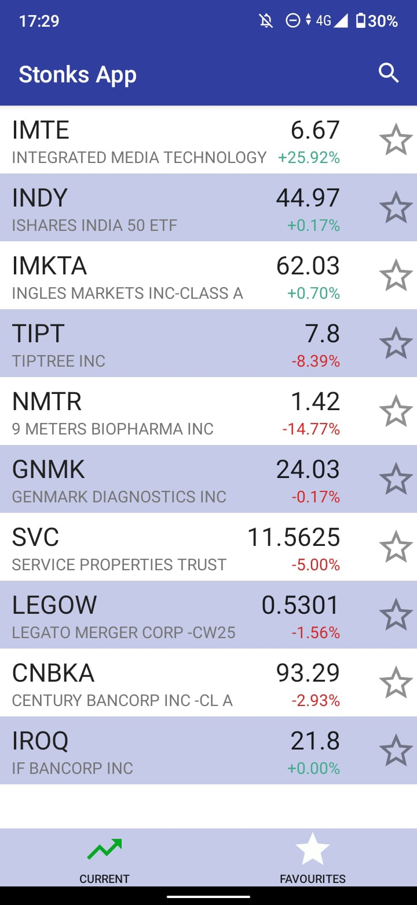
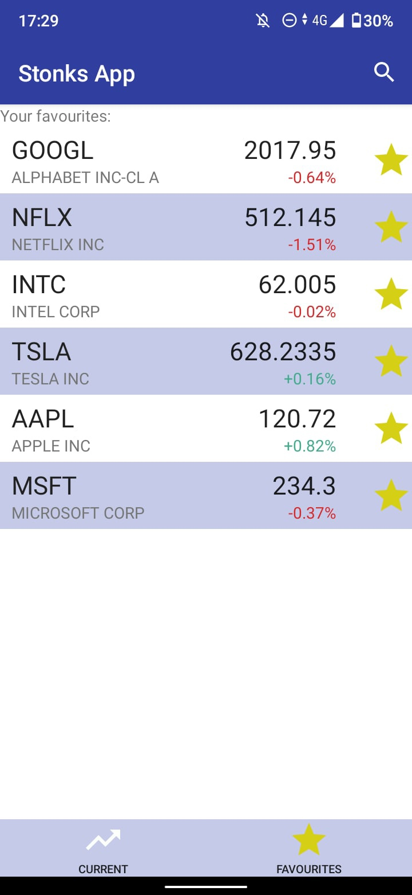
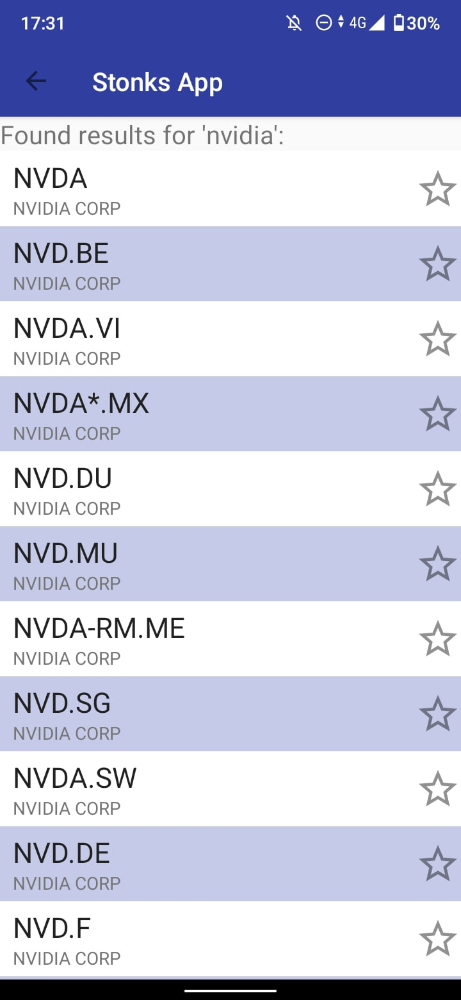

# Stonks App
#### _Make Stonks Great Again!_

## Description
Stonks App is an Android application for online checking mainstream stocks
and keeping some of them as favourites for convenient tracking.

#### What can it do?
On main page you get list of stocks from XNGS(XNAS) MIC code [NASDAQ]. You can see name of company, its symbol, current price, which updates online (using [WebSocket](https://github.com/TakahikoKawasaki/nv-websocket-client)), and change of price this day. You can keep it in 'Favourite' list for convenient tracking. Also you can retrieve stocks by searching them in SearchView (with 'GET' queries over HTTPS connection).

#### What's next?
It's going to be updated:
- Provide more stability and speed by using _reactive libraries_ ([this](https://github.com/ReactiveX/RxJava) or [this](https://github.com/ReactiveX/RxKotlin))

## Requirements
- minSdkVersion 23 (Android 6 Marshmallow)

#### Tests were held on:
- Physical device (Android Q, SdkVersion 30)
- Virtual device in Android Studio (Android 8, SdkVersion 26)

## Tools
- [Finnhub API](https://finnhub.io/) - retrieving all financial information about stocks, companies and etc.
- [nv-websocket-client](https://github.com/TakahikoKawasaki/nv-websocket-client) - providing user with stable online updates of current prices for more convenience

## Screenshots
  

## Communication
Send an e-mail to danisHaz112345@gmail.com for communication.

## Bugs and issues
For bugs, questions and discussions please use the [Github Issues](https://github.com/danisHaz/Stonks-App/issues).
